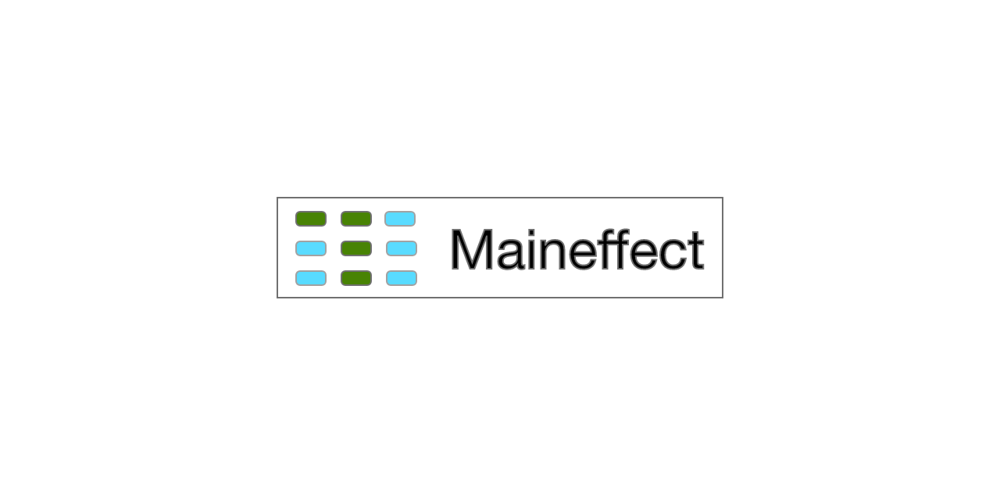

[Home](./) | [Getting Started](./getting-started) | [How It Works](./how-it-works) | [API Reference](./api-reference) | [Guides](./guides) | [Examples](./examples) | [Why Maineffect?](./why-maineffect)

---




# Unit test any JavaScript function with zero dependencies installed.

Maineffect is a testing library that isolates functions from their dependencies at the source level. It parses your code into an [AST](https://en.wikipedia.org/wiki/Abstract_syntax_tree), strips all imports, and lets you inject only what you need. The function under test runs in a sandbox — no module resolution, no dependency installation, no complex mocking setup.

This means you can test code that depends on databases, APIs, loggers, or any external module **without installing any of them**.

## Quick example

```js
// math.js
import log from 'logger'

const add = (a, b) => a + b
```

```js
// math.test.js
import { parseFn } from 'maineffectjs'

const math = parseFn(require.resolve('./math'))

describe('add', () => {
  it('should return the sum of two numbers', () => {
    const result = math.find('add').callWith(51, 82)
    expect(result).to.equal(133)
  })
})
```

`add` is not exported. The `logger` module is not installed. The test works anyway.

## Get started

- [Installation & first test](./getting-started)
- [Full API Reference](./api-reference)
- [Practical Guides](./guides)
- [All Examples](./examples)
- [Why Maineffect over Jest mocking?](./why-maineffect)

## Works everywhere

Maineffect ships two builds:

- **Node.js** — executes in a `vm` sandbox
- **Browser** — executes via `eval()`

Because dependencies are stripped at the AST level, there is no module system to hook into. Tests can run in a browser with no bundler, no `node_modules`, no build pipeline.

## Supports

- JavaScript and TypeScript
- Async/await and Promises
- Function declarations, expressions, and arrow functions
- Class methods and React lifecycle methods
- React hooks and functional components
- Jest, Mocha/Chai, and Sinon

## Demo

[Watch the video](https://www.youtube.com/playlist?list=PLvTEsBHbZnNGwLD3Uy5YEBaKv417-tJGH)
